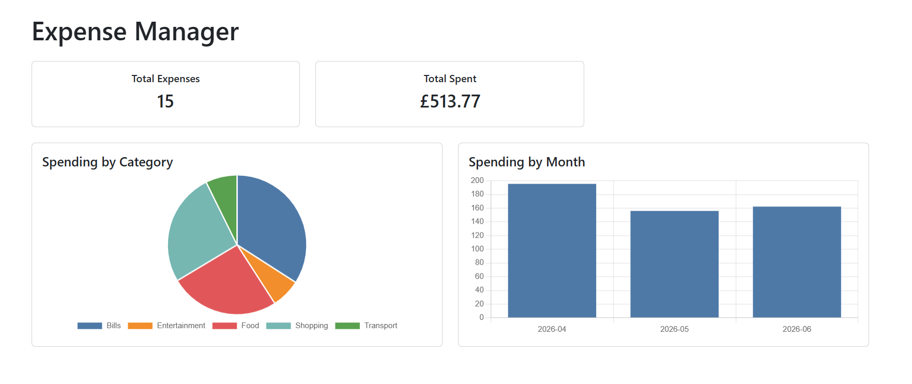
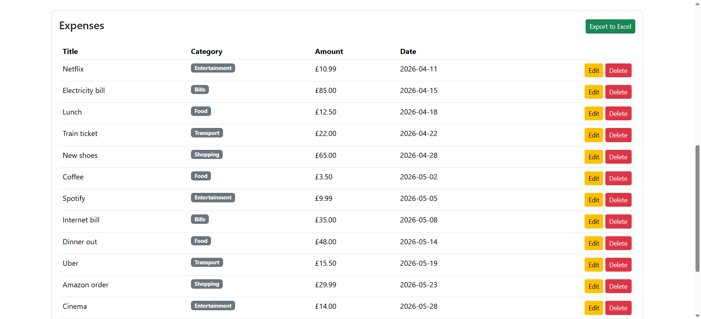
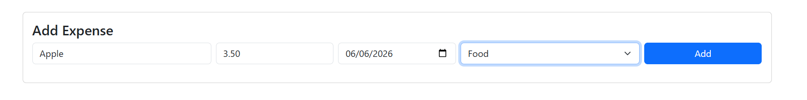
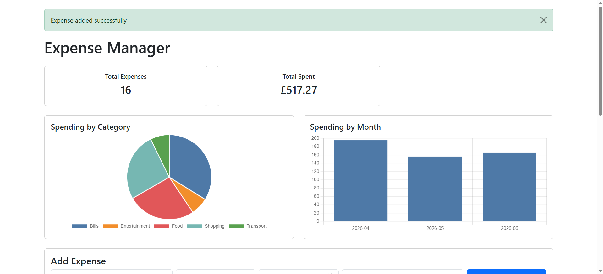

# Expense Tracker (Python / Flask Web App)

## 📌 Description

A web-based expense tracker built with Python and Flask, evolved from an initial CLI version.
Users can add, edit, and delete expenses, categorize them, and view a live dashboard with total spending and category breakdown.
Data is persisted using SQLite via Flask-SQLAlchemy.

---

## 🚀 Features

- Add, edit, and delete expenses with confirmation popup
- Categorize expenses (Food, Transport, Shopping, Entertainment, Bills, Other)
- Date tracking per expense
- Dashboard showing total spent and expense count
- Spending charts — category pie chart and monthly bar chart
- Input validation with error messages
- Flash notifications for add, update, and delete actions
- Export expenses to Excel (.xlsx)
- Data persistence with SQLite database

---

## 🛠 How to Run

1. Clone the repository
2. Create and activate a virtual environment:
```bash
    python -m venv .venv
    .venv\Scripts\activate        # Windows
    source .venv/bin/activate     # Mac/Linux
```
3. Install dependencies:
```bash
    pip install -r requirements.txt
```
4. Run the app:
```bash
    python app.py
```
5. Open your browser at `http://127.0.0.1:5000`

---

## 📂 Project Structure

```
ExpenseTracker/
├── app.py
├── models.py
├── seed.py
├── requirements.txt
├── templates/
│   ├── index.html
│   └── edit.html
└── README.md
```

---

## 🛠 Tech Stack
- Python
- Flask
- Flask-SQLAlchemy
- SQLite
- Jinja2
- Bootstrap 5
- Chart.js
- openpyxl

---

## 📚 What I Learned

- Building web apps with Flask
- Database modeling and queries with SQLAlchemy
- CRUD operations with SQLite
- Input validation and error handling
- Jinja2 templating
- Data visualisation with Chart.js
- File export with openpyxl
- Flash messaging and Flask sessions
- Structuring a Python web project

---

## 📸 Screenshots

### Dashboard


### Expenses Table


### Add Expense


### Flash Message

